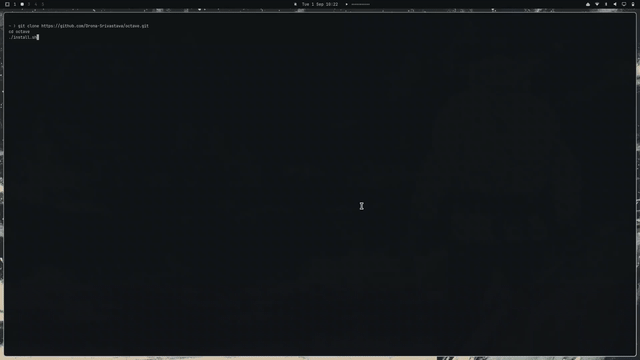
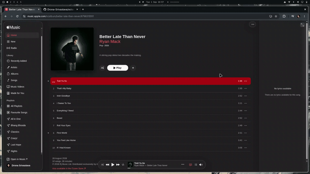

# Octave

A lightweight Linux music client that imports Apple Music playlists through
[Gamdl](https://github.com/glomatico/gamdl), indexes local audio files, and
plays them with `mpv`. Apple Music is only needed during import or refresh.

## Features

- Import Apple Music playlists and give them local names.
- Play local `m4a`, `mp3`, `flac`, `ogg`, `opus`, and `wav` files.
- Search, sort, shuffle, repeat, seek, and rescan your library.
- Request synced LRC lyrics when available without requiring them for playback.
- Edit playlist membership in TOML and refresh playlists from saved URLs.

## Demos

See Octave in action before installing:

### Installation and playlist setup



[Download the installation and playlist setup demo](demo/octave_demo.mp4)

### Playlist refresh



[Download the playlist refresh demo](demo/refresh.mp4)

## Arch Linux installation

Octave requires Python 3.11+, `uv`, `gamdl`, `mpv`, `ffmpeg`, and `chafa`.
Install the system dependencies with:

```bash
sudo pacman -Syu --needed git python uv mpv ffmpeg chafa curl
```

Clone and install Octave:

```bash
git clone https://github.com/Drona-Srivastava/octave.git
cd octave
./install.sh
```

The installer creates an `octave` command and adds Octave to the Linux
application menu. It also installs `gamdl` with `uv`.

Alternatively, install directly from the GitHub source archive:

```bash
curl -fsSL https://github.com/Drona-Srivastava/octave/archive/refs/heads/main.tar.gz \
  | tar -xz && cd octave-main && ./install.sh
```

Octave configures Gamdl for the reliable `aac-web` codec, FFmpeg-backed
downloads, saved playlist manifests, and a private temporary directory under
`~/.config/octave/.gamdl-temp`. Synced LRC lyrics are requested when Apple
Music provides them, but they are optional; a song remains fully playable when
no lyrics are available.

Octave uses the system Python selected by `python3` (or `python`). Python
3.11 or newer is supported; the installer does not require exactly Python
3.11. `uv` is used to create an isolated tool environment and install Python
dependencies, so project packages do not need to be installed globally.

## First-time setup

Export your Apple Music browser cookies in Netscape format, then run:

```bash
octave setup --cookies /path/to/cookies.txt \
  --playlist 'https://music.apple.com/.../playlist/...'
```

You can import more playlists by repeating `--playlist`, or add one later
from inside the TUI with `a`.

## Import and launch

```bash
octave import 'https://music.apple.com/.../playlist/...'
octave
```

## Commands

```bash
octave                  # Launch the TUI
octave status           # Show indexed track count
octave update           # Rescan local audio files
octave playlists        # List playlists
octave songs            # List indexed songs
octave config           # Show the active config path
```

`amt` and `apple-music-tui` remain available as compatibility command names.

## TUI controls

| Key | Action |
| --- | --- |
| `Enter` | Play selected song |
| `←` / `→` | Seek backward/forward 5 seconds |
| `p` | Pause or resume |
| `n` / `b` | Next/previous song |
| `s` | Toggle shuffle |
| `t` | Toggle repeat |
| `a` | Add a playlist |
| `f` | Refresh the selected playlist |
| `r` | Rename playlist |
| `d` | Delete playlist |
| `x` | Remove song from playlist |
| `/` | Search |
| `o` | Change sort order |
| `u` | Rescan library |
| `Ctrl+T` | Change and save theme |
| `q` | Quit |


## Configuration and storage

By default, Octave stores configuration, cookies, downloaded media, playlists,
and the SQLite index under `~/.config/octave/`. Gamdl temporary files are kept
in `.gamdl-temp` inside the same directory. The selected theme is stored in the
`[ui]` section and restored on the next launch.

### Editable playlists

Playlist membership is stored in editable TOML files under
`~/.config/octave/Playlists/<playlist-name>/playlist.toml`. SQLite remains the
metadata index; it is not necessary to edit the database manually. Each
playlist file contains a `tracks` list with paths relative to the library:

```toml
name = "Road Trip"
source_url = ""
updated_at = ""
tracks = [
  "Artist/Album/song-one.m4a",
  "song-two.mp3",
]
```

Add or remove paths in `tracks`, run `octave update`, and reopen or rescan the
playlist. Apple Music imports create the initial `tracks` list; later TOML edits
are kept. Press `f` on a playlist to refresh it from Apple Music using its
saved URL and the latest cookies file.

To use another library or player, edit the configuration file, for example:

```toml
[library]
path = "~/.config/octave"

[playback]
player = "mpv"

[ui]
theme = "textual-dark"
```

Logs are stored under the platform's user state directory. On most Linux
systems this is `~/.local/state/octave/log/amt.log`.

## Troubleshooting

- Check `python3 --version`; it must be 3.11 or newer.
- Check `command -v octave`, `command -v gamdl`, `command -v mpv`, and
  `command -v ffmpeg` if installation or playback fails.
- Run `octave status` before launching the TUI to confirm that the library is
  configured and readable.
- Imports require a valid Netscape-format Apple Music cookie export. Cookies
  may expire and need to be exported again.
- If the application menu does not refresh immediately, run:

  ```bash
  update-desktop-database ~/.local/share/applications
  ```

## Uninstall

Remove the Octave command and application-menu entry with:

```bash
./uninstall.sh
```

This keeps your music library and configuration. Remove `~/.config/octave`
manually only if you also want to delete your settings and cookies.
